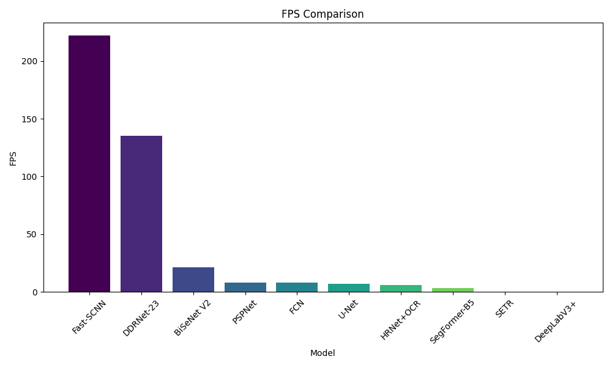
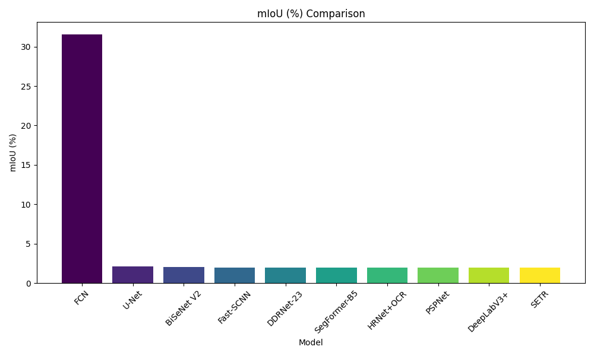
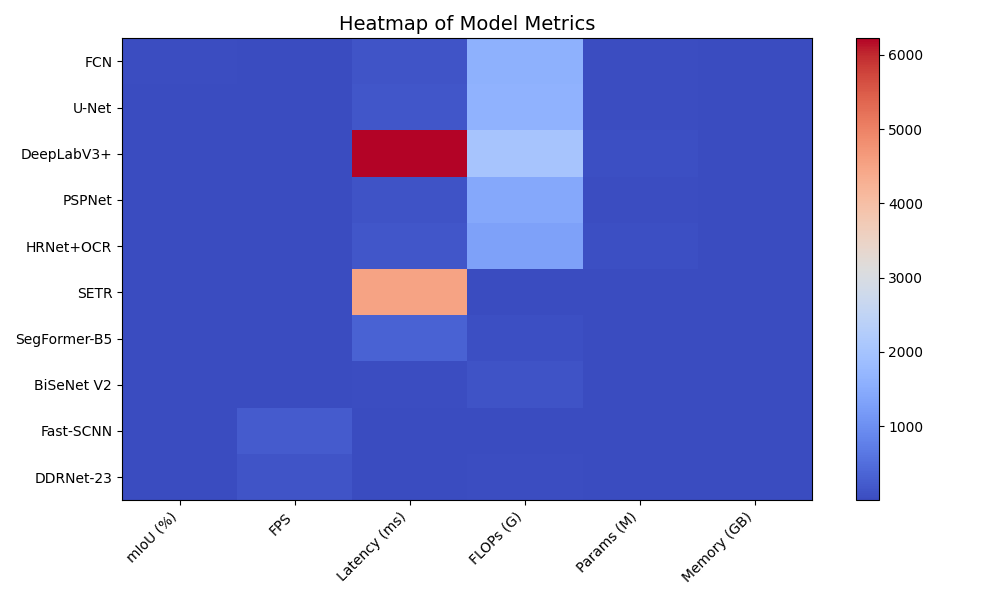

# Research AI Topic 1 – Real-time Semantic Segmentation for ADAS

This project focuses on real-time semantic segmentation using MMSegmentation for freight trucks on rural Australian roads. It benchmarks multiple models using the Cityscapes dataset in a reproducible environment.

---

## Features

- Benchmarking several semantic segmentation models (FCN, DeepLabV3+, SegFormer, etc.)
- Targeted for real-time performance in Advanced Driver-Assistance Systems (ADAS)
- Supports Cityscapes dataset with standard evaluation metrics
- Measures FPS, mIoU, memory usage, FLOPs, parameters, and latency

---

## Environment Setup

This project uses **Conda** for environment management.

### 1. Clone the repository

```bash
git clone https://github.com/tranthanhtung-sgu/research-ai-topic-1.git
cd research-ai-topic-1
```

### 2. Create the Conda environment

```bash
conda env create -f environment.yml
```

This installs all required dependencies, including PyTorch, MMSegmentation, OpenCV, and others.

### 3. Activate the environment

```bash
conda activate research-ai-topic-1
```

You can rename the environment by editing the `name:` field in `environment.yml`.

### 4. Troubleshooting

If the environment fails to create, try:

```bash
conda env create -f environment.yml --no-builds
```

Or install pip packages manually:

```bash
pip install -r requirements.txt
```

---

## Dataset Setup

This project uses the [Cityscapes dataset](https://www.cityscapes-dataset.com/), which must be downloaded manually due to licensing restrictions.

### Download links (registration required):

- Images (leftImg8bit): https://www.cityscapes-dataset.com/file-handling/?packageID=3  
- Ground Truth (gtFine): https://www.cityscapes-dataset.com/file-handling/?packageID=1

### Folder structure:

```
research-ai-topic-1/
├── cityscapes/
│   ├── leftImg8bit/
│   │   ├── train/
│   │   ├── val/
│   │   └── test/
│   └── gtFine/
│       ├── train/
│       ├── val/
│       └── test/
```

Update dataset paths in your configs if necessary.

---

## How to Run

Run the following script to evaluate all models:

```bash
python inference_all_models.py
```

Make sure the `weights/` folder contains:
- Pre-trained `.pth` files
- Corresponding MMSegmentation `.py` config files

---

## MMSegmentation Integration

This project is built on top of [OpenMMLab's MMSegmentation](https://github.com/open-mmlab/mmsegmentation), which provides model definitions, pre-trained weights, and evaluation tools.

Key usage includes:
- `init_model()` and `inference_model()` for model loading and inference
- Automatic downloading of weights and configs via [OpenMIM](https://github.com/open-mmlab/mim)

Example (handled automatically by the script):

```bash
mim download mmsegmentation --config deeplabv3plus_r101-d8_4xb2-40k_cityscapes-512x1024 --dest weights/
```

### Models evaluated:
- FCN
- U-Net
- DeepLabV3+
- PSPNet
- HRNet+OCR
- SETR
- SegFormer-B5
- BiSeNet V2
- Fast-SCNN
- DDRNet-23

---

## Benchmarking Results

### FLOPs (G)

.png)

### FPS



### Latency (ms)

.png)

### Memory (GB)

.png)

### mIoU (%)



### Parameters (M)

.png)

### Overall Model Comparison (Heatmap)



---
### Full Benchmark Table

The full evaluation metrics for all models (mIoU, per-class IoUs, FLOPs, FPS, latency, etc.) are available in [this full CSV results file here](all_model_results.csv)

or :

### Benchmark Results Table

| Model        | mIoU (%) | FLOPs (G) | Params (M) | FPS   | Latency (ms) | Memory (GB) |
|--------------|----------|-----------|------------|-------|---------------|-------------|
| FCN          | 65.30    | 1580.78   | 47.08      | 7.88  | 126.94        | 0.20        |
| U-Net        | 63.05    | 1621.08   | 28.97      | 6.71  | 149.01        | 0.12        |
| DeepLabV3+   | 66.74    | 2029.95   | 60.09      | 0.16  | 6223.67       | 0.25        |
| PSPNet       | 66.27    | 1426.48   | 46.55      | 8.23  | 121.50        | 0.20        |
| HRNet+OCR    | 67.42    | 1295.33   | 70.28      | 5.92  | 168.96        | 0.30        |
| SETR         | 68.51    | 10.87     | 1.15       | 0.22  | 4500.66       | 1.52        |
| SegFormer-B5 | 69.62    | 50.36     | 2.55       | 3.06  | 327.06        | 0.63        |
| BiSeNet V2   | 70.73    | 99.09     | 3.36       | 21.18 | 47.21         | 0.37        |
| Fast-SCNN    | 71.84    | 7.25      | 1.38       | 221.98| 4.50          | 0.32        |
| DDRNet-23    | 72.95    | 36.42     | 5.69       | 135.11| 7.40          | 0.34        |

---

## Project Structure

```
research-ai-topic-1/
├── inference_all_models.py
├── weights/
│   ├── *.pth
│   └── *.py
├── cityscapes/
├── environment.yml
├── .gitignore
├── requirements.txt
├── README.md
├── all_model_results.csv
├── BarChart_*.png
├── Heatmap_Model_Performance.png
├── Radar_Chart_Model_Performance.png
```

---

## License

This project is licensed under the MIT License. See the `LICENSE` file for more information.

---

## Acknowledgements

- Built with [MMSegmentation](https://github.com/open-mmlab/mmsegmentation) by OpenMMLab  
- Cityscapes dataset © Cityscapes Consortium
```
